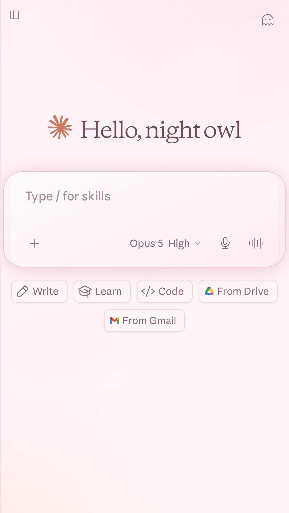
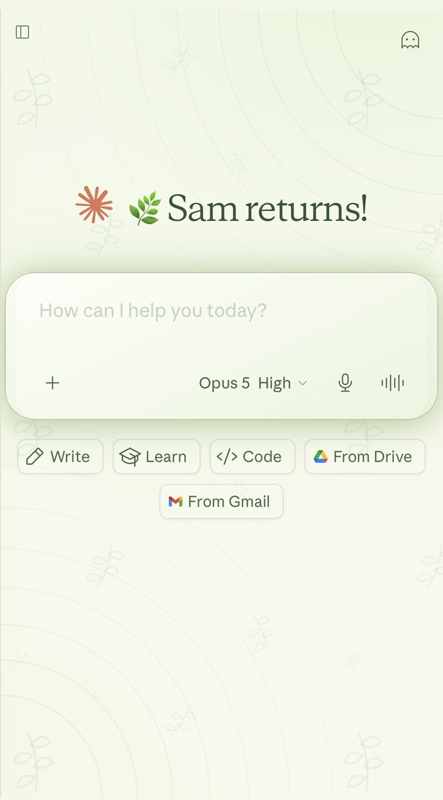
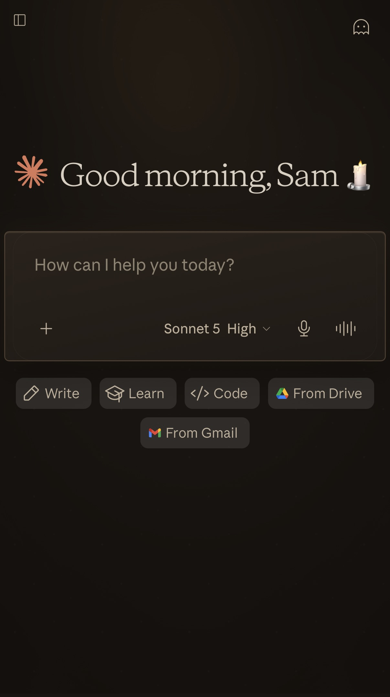
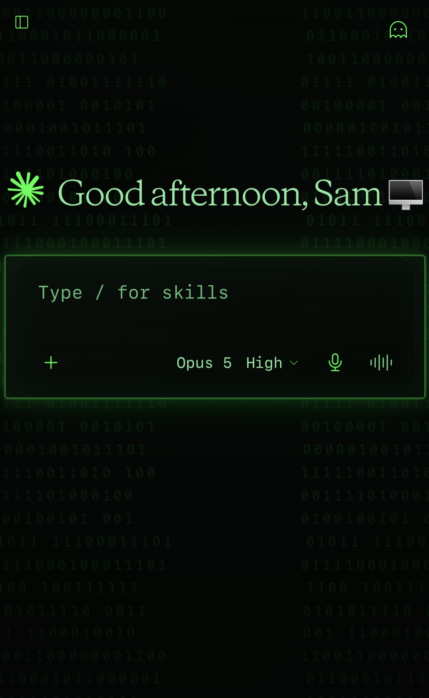

# claude-themes 🌸

Pretty CSS themes for [claude.ai](https://claude.ai) — soft palettes, custom fonts, and message bubbles that don't look like everyone else's.

No coding needed. You install one browser extension, click one link, and your Claude looks different.

> [!IMPORTANT]
> **Set claude.ai's own light/dark setting to match the theme before you install.**
>
> A light theme needs claude.ai in **light mode**; a dark theme needs it in **dark mode**. Get this wrong and parts of the interface — the model picker, some menus — will be unreadable, and the theme will look broken when it isn't. It's in claude.ai's own settings, not the extension's.

---

## Which file do I need?

There are two versions of every theme. Pick based on **which extension you're using**, not which phone you have.

| | **Stylus** | **Userscripts** |
|---|---|---|
| **Works on** | Firefox & Chrome on desktop, Firefox on Android | Safari on iPhone, iPad, and Mac |
| **You want the file ending in** | `.user.css` | `.user.js` |
| **Extras** | Core theme | Full version — also styles markdown *inside your own messages* |

Both give you the same look. The Safari version just does a little bit more, because Userscripts can run JavaScript and Stylus can't.

---

## Themes

### 🍓 Strawberry Clouds

A soft pink light theme. Pastel pink, peach and cream, a faintly sparkling background, glassy menus, and cloud-shaped message bubbles for everything you send. Built to be gentle on the eyes and light on battery.



**Install →** [Stylus version](https://raw.githubusercontent.com/anarchicgroove/claude-themes/main/strawberry-clouds/strawberry-clouds.user.css) · [Userscripts version](https://github.com/anarchicgroove/claude-themes/blob/main/strawberry-clouds/strawberry-clouds.user.js)

### 🍵 Matcha Mornings

A soft sage-green light theme. Pale tea and cream, thin hand-drawn ferns drifting across the background, deep green ink, and stitched message bubbles that look a bit like a little chalkboard. Same gentle, low-battery approach as Strawberry Clouds, in a completely different flavour.



**Install →** [Stylus version](https://raw.githubusercontent.com/anarchicgroove/claude-themes/main/matcha-mornings/matcha-mornings.user.css) · [Userscripts version](https://github.com/anarchicgroove/claude-themes/blob/main/matcha-mornings/matcha-mornings.user.js)

### 🕯️ Ink & Candlelight

A warm near-black dark theme — an old book in a room with one lamp on. Brown-black rather than blue-black, a proper book serif, bone-parchment text, and sharp corners everywhere. Your messages aren't filled in; they're framed by a fine line, backlit as though the same candle were behind them, with a single deep oxblood red used sparingly enough that it still means something.



*This is a **dark** theme — set claude.ai to dark mode before you install it.*

**Install →** [Stylus version](https://raw.githubusercontent.com/anarchicgroove/claude-themes/main/ink-and-candlelight/ink-and-candlelight.user.css) · [Userscripts version](https://github.com/anarchicgroove/claude-themes/blob/main/ink-and-candlelight/ink-and-candlelight.user.js)

### 🖥️ Phosphor

A retro terminal dark theme — an old CRT monitor that somehow got the internet. Black screen, faint tiled binary behind everything, scanlines and a soft vignette over the top, and phosphor green from corner to corner. There are no message bubbles at all, and that's the design: what you send appears as a terminal prompt with a `>` in front of it, and Claude's replies arrive as raw output running down the screen, ending in a fat blinking block cursor. The glow is kept on the composer where it belongs, so long messages stay readable instead of smearing.



*This is a **dark** theme — set claude.ai to dark mode before you install it.*

**Install →** [Stylus version](https://raw.githubusercontent.com/anarchicgroove/claude-themes/main/phosphor/phosphor.user.css) · [Userscripts version](https://github.com/anarchicgroove/claude-themes/blob/main/phosphor/phosphor.user.js)

---

## How to install

> [!IMPORTANT]
> **Set claude.ai's own light/dark setting to match the theme before you install.**
>
> A light theme needs claude.ai in **light mode**; a dark theme needs it in **dark mode**. Get this wrong and parts of the interface — the model picker, some menus — will be unreadable, and the theme will look broken when it isn't. It's in claude.ai's own settings, not the extension's.

<details>
<summary><b>💻 Stylus — Firefox or Chrome on desktop</b></summary>

1. Open your browser's add-on store and search for **Stylus**. Install it.
   *(Careful — there's an older extension called **Stylish** with a similar name. You want Stylus.)*
2. Click the **Stylus version** link for the theme you want, above.
3. Stylus will open its own install page showing the theme's name and details. Click **Install style**.
4. Reload claude.ai. Done. 🎉

To turn it off later, click the Stylus icon in your toolbar and toggle the theme off.

</details>

<details>
<summary><b>📱 Firefox on Android</b></summary>

Same as the desktop steps — Firefox for Android supports add-ons, so Stylus works there too.

1. Install **Firefox** from the Play Store if you don't have it.
2. In Firefox, open the **⋮** menu → **Add-ons** → find and install **Stylus**.
3. Tap the **Stylus version** link for the theme you want, above.
4. Tap **Install style** when Stylus offers.
5. Reload claude.ai.

*Heads up: I don't own an Android device, so these steps are written from documentation rather than tested by hand. If something's off, open an issue and tell me what you saw — I'll fix it.*

</details>

<details>
<summary><b>🍎 Userscripts — Safari on iPhone, iPad, or Mac</b></summary>

This one has a few more steps, because Safari extensions read scripts out of a folder on your device.

**First-time setup (only once, ever):**

1. Install **Userscripts** from the App Store. It's free.
2. Open the Userscripts app and set a **scripts directory** — it'll walk you through picking or making a folder. Remember where you put it.
3. Open Safari → tap the **ᴀA** icon in the address bar → **Manage Extensions** → turn on **Userscripts**.
4. Tap **ᴀA** again → **Userscripts** → set claude.ai to **Always Allow**.

**Then, to add a theme:**

5. Tap the **Userscripts version** link for the theme you want, above.
6. On that GitHub page, tap the **⋯** menu → **Raw file content** → **Download**.
7. Open the **Files** app → **Downloads** → press and hold the downloaded file → **Move** → put it in your Userscripts folder.
8. Reload claude.ai. 🎉

To turn it off later, open the Userscripts app and toggle the theme off.

</details>

---

## Notes

- **Turn on one theme at a time.** All of these target claude.ai, and they layer their backgrounds onto different parts of the page — so two enabled at once won't replace each other, they'll stack, and you'll get one theme's clouds sitting on another theme's background. If something looks scrambled, check that the others are switched off.
- These themes are designed around the **mobile** claude.ai layout, so they look their best on a phone. They work on desktop too, just with more empty space at the edges.
- Claude's own interface changes from time to time. If a theme suddenly looks half-broken, that's usually why — open an issue and I'll take a look.

---

## Want your own theme?

You don't need to know how to code. Claude can write the whole file for you — that's how every theme in here was made.

Two things make the difference between a frustrating attempt and a good one:

**Tell it which extension you're using.** The file format isn't cosmetic. Stylus needs a UserCSS file; Userscripts needs a userscript. If Claude guesses wrong, the file will install cleanly and then do absolutely nothing, which is a miserable way to spend an evening.

**Show it pictures.** Claude can't see your screen. A screenshot of what you've currently got, plus a description of what you want instead, is worth several paragraphs of explaining.

Here's a prompt to start from — fill in the brackets and delete the option that isn't you:

```
I'd like a custom theme for claude.ai. I'm not a coder, so please
explain anything I need to do on my end.

I use [Stylus on Firefox/Chrome on desktop] / [Stylus on Firefox for
Android] / [Userscripts on Safari on my iPhone], so I need a
[.user.css file in UserCSS format] / [.user.js userscript file].

The look I'm going for: [describe it — colours, light or dark, any
font you like, whether message bubbles should be rounded, square,
or some other shape, and the general mood].

Please write the complete file, and tell me how to install it.
```

Then expect to go back and forth a bit. Screenshot what you get, say what looks wrong, let it adjust, repeat. Nothing arrives right on the first attempt — Strawberry Clouds went through a lot of rounds before it looked like it does now, and some of the best bits came out of fixing things that had broken.

**Or start from one of these.** Open any theme file here, hand the whole thing to Claude, and ask for what you want changed. *"Make this one dark blue and green, and give the bubbles sharp corners"* is a perfectly good place to begin — and starting from something that already works saves you the fiddliest part.

---

Themes by **neb**, built in collaboration with Claude.
Released under the [MIT License](LICENSE) — use them, change them, share them.
